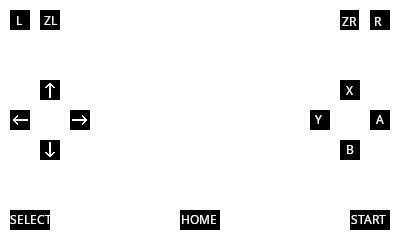

## bmbt3DS 
**b**are-**m**etal **b**utton **t**ester for the **3DS** 

Button tester running fully on the arm9 processor. ZL/ZR support and HOME button support.

## Usage

Place the firm file in /luma/payloads on the SD card and launch it by holding START on boot with Luma3DS 8.0 or higher installed. It should also work as boot.firm when using recent bootloaders. 

Power off by pressing the POWER button(also a test :p)

## Building
#### Arch Linux
+ requires `arm-none-eabi-gcc`, `arm-none-eabi-newlib` and [firmtool](https://github.com/TuxSH/firmtool) 
+ Install arm-none-eabi-gcc and arm-none-eabi-newlib with \
 ```(sudo) pacman -S arm-none-eabi-gcc arm-none-eabi-newlib```

## Button layout

